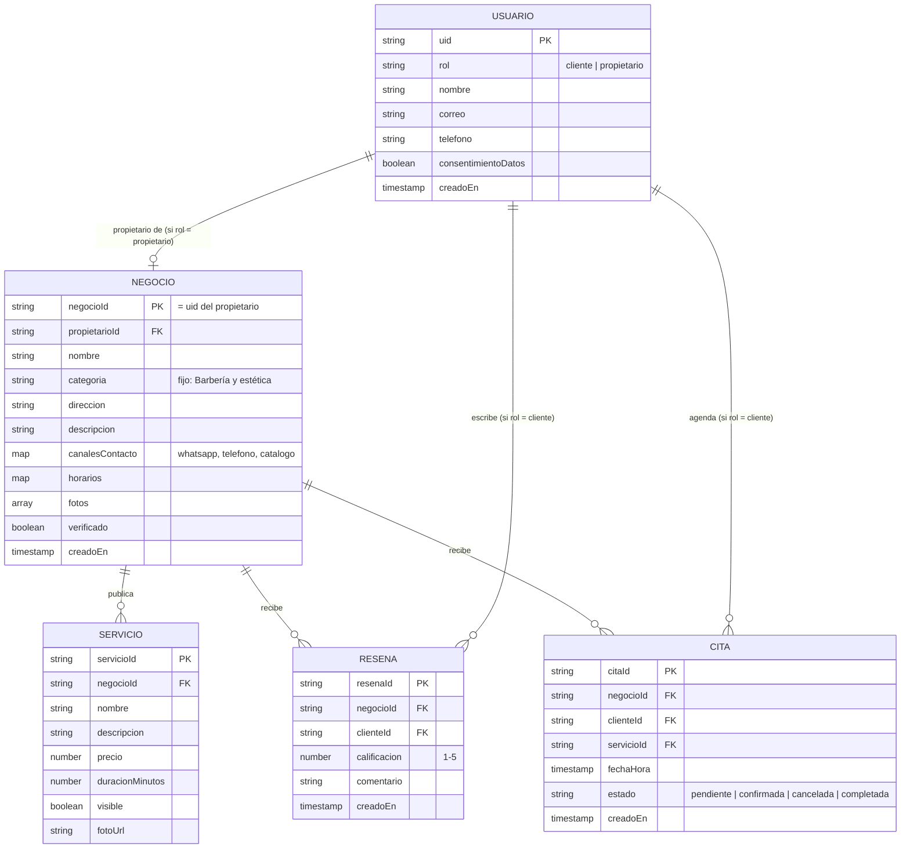

# Modelo de datos — MiniBarrio (Objetivo específico 2)

Firestore es una base de datos NoSQL orientada a documentos, así que el
"modelo entidad-relación" del proyecto (actividad 2.4 del cronograma) se
expresa como colecciones y subcolecciones de documentos, no como tablas con
llaves foráneas. Este documento cumple ese entregable (MER aprobado, Hito 2)
y sirve como referencia directa para escribir las reglas de seguridad
(`firestore.rules`) y el código de las páginas.

## Diagrama (equivalente a un MER)



## Estructura real en Firestore

```
usuarios/{uid}
negocios/{negocioId}                 // negocioId == uid del propietario
negocios/{negocioId}/servicios/{servicioId}
negocios/{negocioId}/resenas/{resenaId}
citas/{citaId}                       // colección raíz (se consulta por clienteId y por negocioId)
```

### Por qué estas decisiones

- **`negocioId == uid del propietario`**: simplifica las reglas de seguridad
  (`firestore.rules`) porque no hay que buscar "¿qué negocio pertenece a este
  usuario?" — es el mismo id. Válido para el alcance actual (1 propietario,
  1 negocio). Si en el futuro un propietario pudiera tener varios negocios,
  se movería a un `negocioId` autogenerado y un campo `propietarioId` de
  búsqueda (ver recomendaciones al final).
- **`servicios` y `resenas` como subcolecciones de `negocios`**: se consultan
  casi siempre junto con el negocio (perfil de barbería → RF-12), y así las
  reglas de seguridad quedan acotadas por negocio de forma natural.
- **`citas` como colección raíz** (no subcolección): un cliente necesita
  poder listar *todas sus citas* en distintos negocios con una sola consulta
  (`where clienteId == uid`), lo que no es posible de forma eficiente si las
  citas estuvieran anidadas dentro de cada negocio.
- **`categoria` fija en "Barbería y estética"**: refuerza en el propio
  modelo de datos el alcance aprobado del proyecto (ver Alcance y
  Limitaciones del documento de trabajo de grado). `RNF-07` pide que la
  arquitectura sea *escalable* a otras categorías a futuro, no que se
  implementen ahora — por eso el campo existe pero no hay UI para cambiarlo.

## Trazabilidad con los requerimientos (RF)

| Colección              | Requerimientos que soporta        |
|-------------------------|------------------------------------|
| `usuarios`               | RF-01                              |
| `negocios`                | RF-02, RF-12, RNF-07                |
| `negocios/{id}/servicios`  | RF-03, RF-04, RF-05, RF-09          |
| `negocios/{id}/resenas`    | RF-10                              |
| `citas`                  | RF-07, RF-08                       |
| `negocios.canalesContacto`| RF-11                              |

## Recomendaciones para cuando se implemente el Sprint 2 (búsqueda y recomendaciones)

- El motor de recomendaciones híbrido (contenido + cercanía, RF-09) puede
  empezar leyendo todos los `negocios` en el cliente (son ≤ 45, ver
  población del estudio) y calculando el score en el navegador — no hace
  falta una Cloud Function todavía. Si el catálogo creciera, ahí sí
  convendría precalcular con una función programada.
- Para el mapa (RF-06) conviene guardar `geopoint` (tipo nativo de Firestore)
  en `negocios.ubicacion` en vez de solo la dirección en texto, para poder
  ordenar por cercanía sin geocodificar en cada búsqueda.
