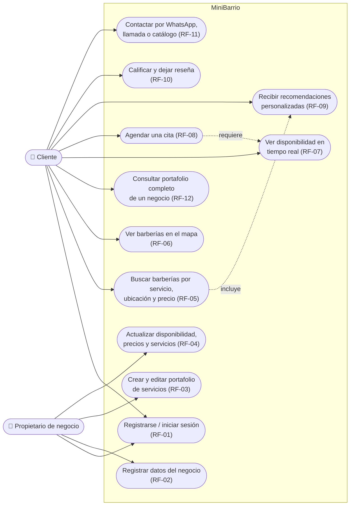
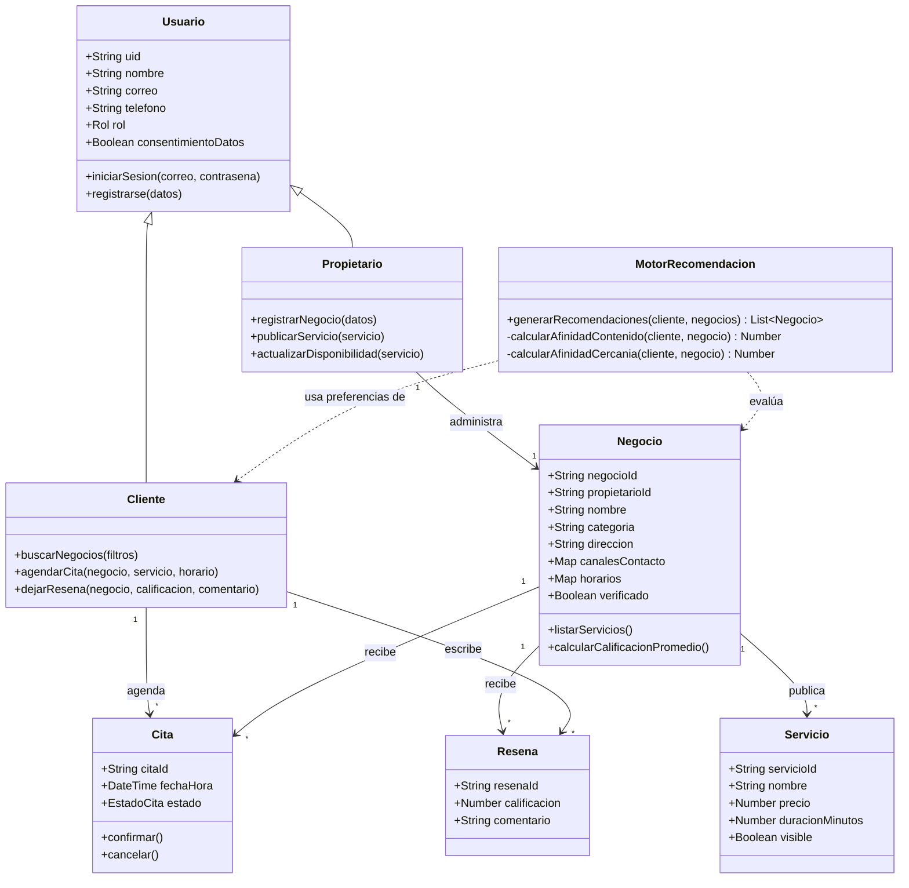
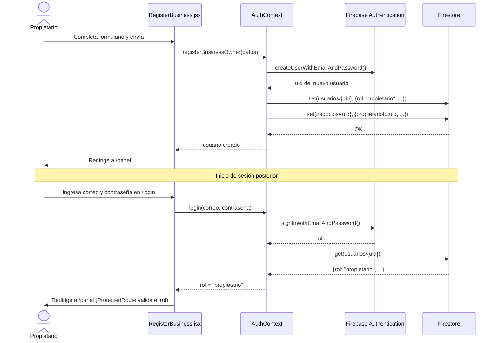
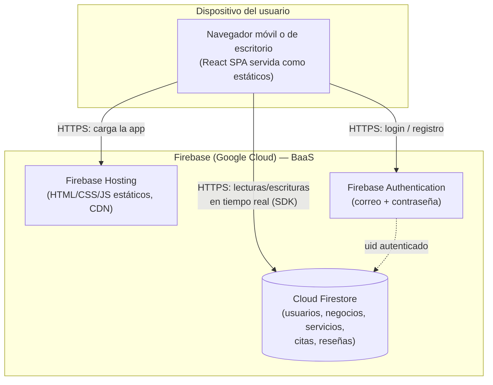

# Diagramas UML — MiniBarrio (Objetivo específico 2)

Corresponde a las actividades 2.2 y 2.3 del cronograma (diagramas de casos de
uso, clases, secuencia y despliegue). Están en Mermaid para que se rendericen
directamente en GitHub y en VS Code (extensión "Markdown Preview Mermaid
Support") sin depender de ninguna cuenta externa, y sirven como borrador
trazable: para el documento final del trabajo de grado, el plan metodológico
pide herramientas como Lucidchart o Draw.io (actividad 2.2), así que lo más
simple es abrir estos mismos diagramas ahí, redibujarlos con la notación UML
formal (Mermaid aproxima casos de uso y despliegue con notación de flowchart,
no con los símbolos UML estándar) y exportarlos como imagen para pegarlos en
el Word.

## 1. Diagrama de casos de uso

Dos actores (Cliente, Propietario de negocio) — sin actor "Administrador",
según el alcance aprobado. Cada caso de uso referencia su RF.

## 2. Diagrama de clases (dominio)

Clases conceptuales del dominio — no son literalmente clases de JavaScript
(Firestore no obliga a modelar así), pero documentan las entidades y sus
relaciones para el sustento académico del diseño (ver `MODELO_DATOS.md` para
cómo se traduce a colecciones reales).

## 3. Diagrama de secuencia — registro y enrutamiento por rol

Cubre el flujo que se acaba de implementar en el código (`AuthContext.jsx`,
`ProtectedRoute.jsx`): el registro crea el usuario en Firebase Auth y su
perfil con rol en Firestore; el login solo autentica y el rol real se lee
siempre desde Firestore (nunca se confía en lo que el usuario seleccionó
en la pantalla).

## 4. Diagrama de despliegue

Arquitectura cliente-servidor con backend como servicio (BaaS), tal como
define la actividad 2.1 del cronograma.

